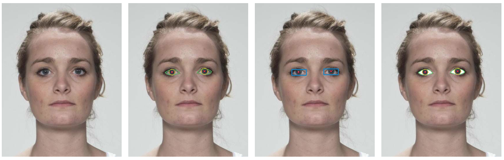

## Robust Sclera Segmentation for Skin-Tone Agnostic Face Image Quality Assessment

This eye sclera segmentation method was introduced as part of a work related to skin tone agnostic face image quality assessment. The original paper can be found on [ieeexplore](https://ieeexplore.ieee.org/abstract/document/10345985) and [arXiv](https://arxiv.org/abs/2312.15102).


## Abstract

Face image quality assessment (FIQA) is crucial for obtaining good face recognition performance. FIQA algorithms should be robust and insensitive to demographic factors. The eye sclera has a consistent whitish color in all humans regardless of their age, ethnicity and skin-tone. This work proposes a robust sclera segmentation method that is suitable for face images in the enrolment and the border control face recognition scenarios. It shows how the statistical analysis of the sclera pixels produces features that are invariant to skin-tone, age and ethnicity and thus can be incorporated into FIQA algorithms to make them agnostic to demographic factors.

## Eye Sclera

The eye sclera refers to the outer layer of the eyeball surrounding the iris. It is the opaque, whitish portion of the eye that surrounds the colored iris and the dark circular opening called the pupil.

## Segmentation Method

|  | 
|:--:| 
| *Landmark-based Sclera Segmentation. Image from [FRLL](https://figshare.com/articles/dataset/Face_Research_Lab_London_Set/5047666)* |

## Segmentation Results

|  | 
|:--:| 
| *Sample segmentation results on [LFW](https://vis-www.cs.umass.edu/lfw/).* |

## Usage

1. Install requirements.
2. Check `src/example` for a sample use.

## Citation

```
@INPROCEEDINGS{kabbani2023scleraseg,
  author={Kabbani, Wassim and Busch, Christoph and Raja, Kiran},
  booktitle={2023 International Conference of the Biometrics Special Interest Group (BIOSIG)}, 
  title={Robust Sclera Segmentation for Skin-Tone Agnostic Face Image Quality Assessment}, 
  year={2023},
  pages={1-6},
  doi={10.1109/BIOSIG58226.2023.10345985}
}
```